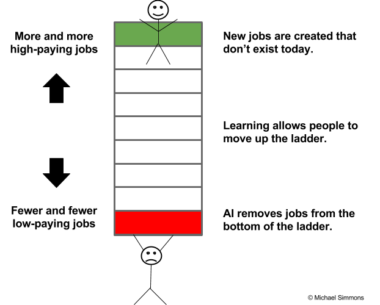

# ARTS

## 1. Algorithm

> 项目地址：[258.AddDigits]( https://leetcode-cn.com/problems/add-digits/description/ )

``` cpp
#include <stdio.h>
#include <stdlib.h>

/*
Given a non-negative integer num, repeatedly add all its digits until the result has only one digit.

Example:

Input: 38
Output: 2 
Explanation: The process is like: 3 + 8 = 11, 1 + 1 = 2. 
             Since 2 has only one digit, return it.
Follow up:
Could you do it without any loop/recursion in O(1) runtime?
*/

int addDigits(int num);

int main() {
	int i,n=99999999;
	time_t t;
	/* 初始化随机数发生器 */
	srand((unsigned) time(&t));
	for(i =0; i <n; i++) {
		int tmp=0;
		tmp=rand() % 99;
		addDigits(tmp);
	}
	printf("for loop run addDisgit %d times.\n", n);
}


int addDigits(int num) {
	int result=num;
	while(result>=10) {
		int a =0;
		int b = 0;
		a = result / 10;
		b = result % 10;
		result = a +b;
	}
	return result;
}
```
起初用C没有思路，尝试了下用python，居然首先做出来的是作为字符然后一个一个顺序去取，再加起来，起效率可想而知。
看了讨论以后，才想起来可以除和取余的方式来得到各个位上的数。然后有了上面的解。
重点来了，最高效率的是用了`num % 9`,这是相当关键的一个点。不过是怎么找出来的呢？
``` 
int addDigits(int num) {
    if (num < 10) {
        return num;
    }
    int result = num % 9;
    if (result == 0) {
        return 9;
    } else {
        return result;
    }
}
```

## 2. Review

- 原文地址：[5-Hour Rule: If you’re not spending 5 hours per week learning, you’re being irresponsible](https://medium.com/the-mission/the-5-hour-rule-if-youre-not-spending-5-hours-per-week-learning-you-re-being-irresponsible-791c3f18f5e6)

> 5小时原则：如果你每周学习不到5小时，你是不负责的

举例巴菲特、奥巴马、比尔盖茨，每周保证阅读时间。知识经济，constant learning持续学习。

- 智力资本>金融资本
没时间成了新的说辞。金钱和知识的关系在变化。技术带来产品服务花费降低，“非货币化”趋势在加速。教育和健康的花费在增加，该领域
的创新也会“非货币化”。新教育机构的新模式让教育更有效、花费更低。新设备和技术变革医疗体系。更关注预防。

- 知识变得越来越有价值
举例自动驾驶工业。未来工作需要的技能，例如数据分析、产品设计、物理治疗，为实现目标而快速学习。
那些在整个职业生涯中努力工作但没有抽出时间来不断学习的人将成为新的“风险”群体。
-  [03.31.16 THE FUTURE OF WORK These Will Be The Top Jobs In 2025 (And The Skills You’ll Need To Get Them)](https://www.fastcompany.com/3058422/these-will-be-the-top-jobs-in-2025-and-the-skills-youll-need-to-get-them)
-  技术和计算思维。软件开发、计算机系统分析、市场分析，岗位增加20%以上。
-  护理。突出在家庭健康救助方面的工作增加38%。
-  社会智能和新媒体文学。
-  终身学习。使用技术寻找最好的信息源来保持知识和技能。碎片化时间学习简短视频。随时随地。
-  adaptability and business acumen.  management analysts ,accountants and auditors.超过40% 的美国工人将会成为独立承包商。


并不是工作本身的缺乏。
-  知识是新金钱。交换媒介，价值存储。
> But, unlike money, when you use knowledge or give it away, you don’t lose it. Transferring knowledge anywhere in the world is free and instant. Its value compounds over time faster than money. It can be converted into many things, including things that money can’t buy, such as authentic relationships and high levels of subjective well-being. It helps you accomplish your goals faster and better. It’s fun to acquire. It makes your brain work better. It expands your vocabulary, making you a better communicator. It helps you think bigger and beyond your circumstances. It puts your life in perspective by essentially helping you live many lives in one life through other people’s experiences and wisdom.

> reading gave him the ability to occasionally “slow down and get perspective” and “the ability to get in somebody else’s shoes.”

### 6个必备技能以把握新知识经济
> 21世纪的文盲将不再是那些不能读写的，而是那些 cannot learn, unlearn, and relearn。  --Alvin Toffler

- 在正确的时间定义知识价值
知识的价值不是静态的。因其他人的认识和稀有度而变化。新技术成熟和工业体系重塑造成技能需求**赤字** ,而后快速填补，再平衡。

- 快速学习掌握知识
自然地机会窗口是短暂的。认识到就快速实践。认知和使用心智模型是最为通用的技能。让知识成体系，可拓展到其他领域。

- 分享你的技能价值给其他人
> People with the same skills can command wildly different salaries and fees based on how well they’re able to communicate and persuade others. 

- 变知识为结果
多种方式在生活中变现。例如薪水更好的工作，提升，成功的商业活动，作为顾问，建立名声成为领导。

- 学会如何在学习上进行经济投资活动高回报
我们每一个需要在书本、在线课程、认证或学位项目中去寻找合适的组合，来帮助我们用预算实现目标。需要运用金融术语：投资回报、
风险管理、最低预期回报率、对冲以及多样化来思考知识投资。

- 掌握学会学习的技能
让学习成效指数级增长，学习率。Over the course of a year,

多些对知识的精明和现实追求，终生学习。努力工作是工业时代的进步方法，在知识经济时代是努力学习。
**长期智力自满**如同长期不运动、饮食不健康、睡眠不足。每周学习少于5小时就是21世纪的吸烟。

###  别偷懒，别找借口，尽管去做完

多数人放弃学习习惯的原因。要日积月累。时间和精力不能成为借口。作为少数能够应对这一挑战的人之一，你可以获得更多奖励。
学习不再是奢侈的，它是日常必须。

### 三步开启今天的学习习惯
> 世界上最忙、最成功的人每天找至少一个小时学习，你也可以。

- 找时间(find the time)
- 保持连贯性(stay consistent)
- 提高学习效率，增加产出(get more result)


## 3. Tip

起因是从windows中拷贝类文档.txt .c 一类，结果编码出问题，不能在linux中utf8显示。

> 3.1.转换编码
>
> 3.2.批量转换

### 3.1.iconv转换文档编码
- 命令`file -i filename`查看文件的字符编码,另外apt安装打enca(??)
- 命令iconv转换字符集， `iconv -f iso-8859-1 -t utf-8 readme.txt `

> 参考：
> [Ubuntu下批量转换文件的字符编码](http://sparkandshine.net/ubuntu-batch-convert-files-character-set/)

### 3.2. 批量转换
在上1中的参考中也有批量转换打实现。不过其中for 循环的位置有问题。查阅参考后，总结效率相对不错打两种方法。
- while循环
``` bash
    While read LINE     # 不转义 read -r
    do
    echo $LINE
    done  < $FILENAME
```

- for 循环
```
    for line in $(cat filename)    # 于1中参考不一致的地方。需要有$(cat  xxx  )
    do
    echo $line
    done
```
> 参考:
> [Shell逐行读取文件的4种方法](https://www.jb51.net/article/59041.htm);[Shell脚本循环读取文件中的每一行](http://www.linuxdiyf.com/linux/25722.html)

### 3.3 实例源码

```
    #!/usr/bin/env bash

    tmp_file="tmp.txt"
    echo "$tmp_file"
    trap "rm -f $tmp_file" exit

    find . -name "*.c" > $tmp_file

    for file in "$(cat ./$tmp_file)"  
# for 方法问题所在，引入打变量作为文件名要合成具体地址。
#    cat $tmp_file | while read file 
    do
        echo "$file"
        #iconv -f iso-8859-1 -t utf-8 $file
        iconv -f gbk -t utf-8 $file -o "$file.new"
        echo "$file done"
        mv "$file.new" $file #replace the old file
    done
```


## 4. Share
不同层次看待问题的视角
> Top-down views
一览众山小，容易产生自我的膨胀。接受的信息面多，看待问题比较全面，容易找到未来变化的方向。
组织联合时力不从心 或 权力通天。部分有无奈感。

> Down-Top views
容易坐井观天、管中窥豹，对结果进行妄加揣测（逻辑线不通、单一）。信息来源少，自身知识体系性不强。针对单一问题、目标
做狭隘的诠释。比较容易常见的是:厚黑轮、关系论、阴谋论。

> Ps.Outsider views
上帝视角。能知道客观真实的过程和完整的信息（初始、转折、结果）


### 世界是复杂的
基本理论
- 辩证唯物论
- 唯物辩证法。
主要观点包括联系、全面、发展和矛盾，主要的特点是承认矛盾是事物发展的内在动力。
- 认识论
- 唯物史观

基本观点
- 实践观点
- 辩证和历史统一


## 5. Summary

暂缺
