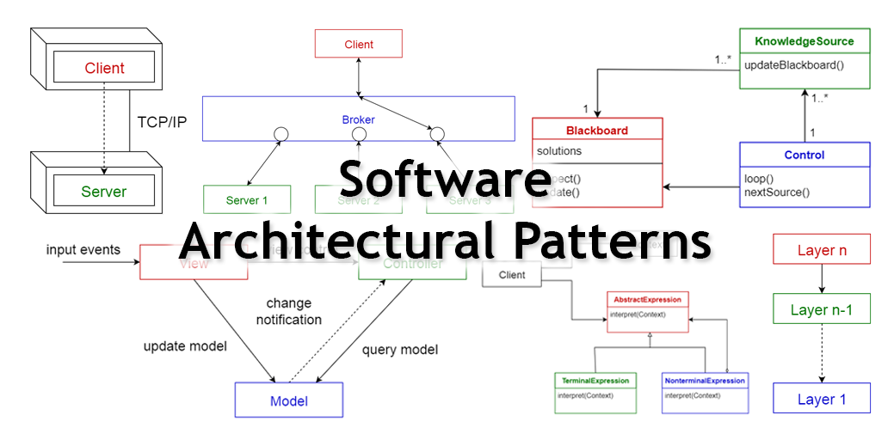
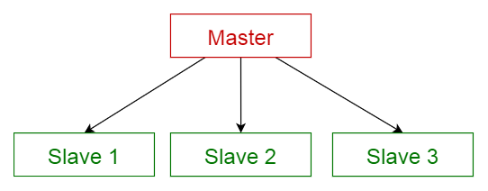
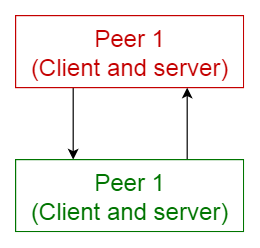
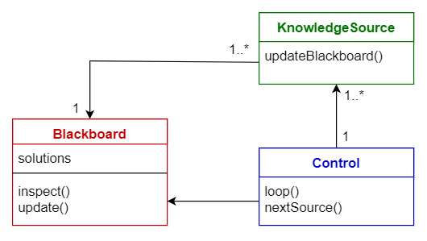
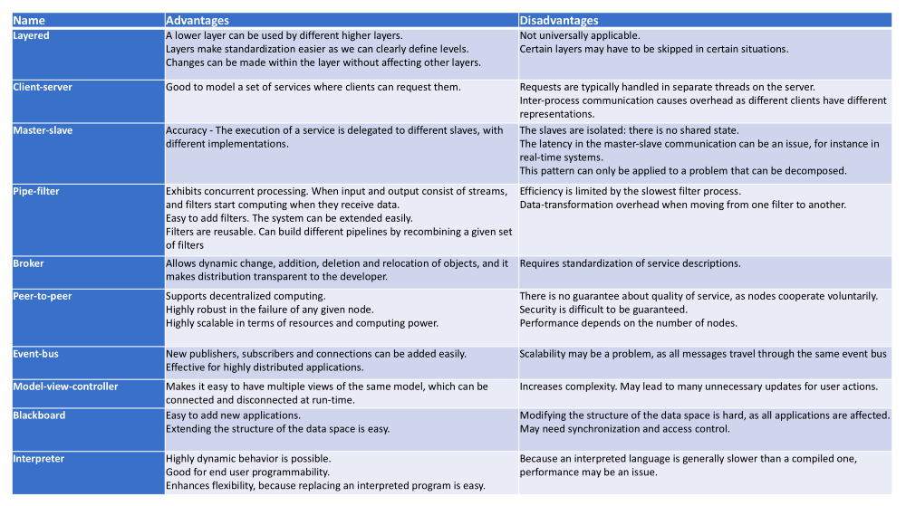

# ARTS

 [Algorithm](#1-algorithm)

 [Review](#1-review)

 [Tip](#3-tip)

 [Share](#4-share)
 
 [Summary](#5-summary)

## 1. Algorithm
Leetcode 中weekly-contest-95  [877. Stone Game](https://leetcode.com/contest/weekly-contest-95/problems/stone-game/)
知乎上推送的一文章讲了uwi的牛逼之处。我对这个问题的理解，第一眼看过去是觉得双端队列约定规则取数。uwi直接判定了先手必胜，那是不是该论证
一下？？
```cpp
bool stoneGame(int *piles, int pilesSize) {
    int front_point = 0;
    int back_point = pilesSize - 1;
    int front_num, back_num;
    long Alex = 0, Lee = 0;
    for (int i = 0; i < pilesSize - 1; ++i) {
        front_num = piles[front_point];
        back_num = piles[back_point];
        if (front_num > back_num) {
            if (i % 2) {
                Lee = Lee + front_num;
            } else {
                Alex = Alex + front_num;
            }
            front_point++;
        } else {
            if (i % 2) {
                Lee = Lee + back_num;
            } else {
                Alex = Alex + back_num;
            }
            back_point--;
        }
        if (front_point == back_point) {
            front_num = piles[front_point];
            if (i % 2) {
                Lee = Lee + back_num;
            } else {
                Alex = Alex + back_num;
            }
            break;
        };
    }
    if (Alex > Lee) return true;
    return false;
}
```
自己的这段主要的问题是只是机械模拟取数的过程，例如`{3, 4, 5, 1, 2}`其结果就有问题。

> LeetCode的[Solution](https://leetcode.com/problems/stone-game/solution/)
``` cpp
bool topStoneGame(int *piles, int pilesSize) {
    int n = pilesSize;

    int table[n][n], gap, i, j, x, y, z;

    // Fill table using above recursive formula. Note that the table
    // is filled in diagonal fashion (similar to http:// goo.gl/PQqoS),
    // from diagonal elements to table[0][n-1] which is the result.
    for (gap = 0; gap < n; ++gap) {
        for (i = 0, j = gap; j < n; ++i, ++j) {
            // Here x is value of F(i+2, j), y is F(i+1, j-1) and
            // z is F(i, j-2) in above recursive formula
            x = ((i + 2) <= j) ? table[i + 2][j] : 0;
            y = ((i + 1) <= (j - 1)) ? table[i + 1][j - 1] : 0;
            z = (i <= (j - 2)) ? table[i][j - 2] : 0;
            table[i][j] = max(piles[i] + min(x, y), piles[j] + min(y, z));
        }
    }
    return table[0][n - 1] > 0;
}
```
练好动态规划是绕不开的。

## 2. Review

[10 Common Software Architectural Patterns in a nutshell](https://towardsdatascience.com/10-common-software-architectural-patterns-in-a-nutshell-a0b47a1e9013)
简要翻译进行学习
### 果壳中的10个软件构架模式

有没有想过如何设计大型企业级系统？在通常开始软件开发之前，必须选择一个合适的构架，以提供需要的功能和质量。在开始应用到我们设计中时，应该理解不同的构架。


#### 什么是构架模式
根据维基百科
> 结构模式：在给定上下文环境中针对软件构架常见问题的一个通用的、可复用的解决方案。结构模式和软件设计模式相似，但是涵盖范围更广。

在本文中，将会简要的介绍下面10个常见构架模式的用途和利弊。
 - Layered pattern 
 - Client-server pattern
 - Master-slave pattern
 - Pipe-filter pattern
 - Broker pattern
 - Peer-to-peer pattern
 - Event-bus pattern
 - Model-view-controller pattern
 - Blackboard pattern
 - Interpreter pattern

##### 1.Layered pattern(分层模式)
这种模式能被用于可分解为多组子任务的结构程序，每一组都是在指定的抽象层级上。每一层都为更高层提供服务。在一个通用系统最常见的4层：
 
 - 展现层（UI 层）
 - 应用层（service 层）
 - 业务逻辑层（domain 层）
 - 数据接入层（持久层）
 
 用途：
 - 通常桌面应用
 - 电子商务Web应用
 
 
 
 ##### 2.Client-server pattern
 由两部分组成：一个服务者 和 多个 客户。服务组件提供向多客户提供服务。服务者持续地监听客户的请求。
 
 用途：
 - 在线应用，如邮件，文档分享和银行业务
 
 
 ##### 3.Master-slave pattern(主从模式)
 主组件分派任务给identical（相同的）slave从组件，最后将从组件返回的结果进行计算。
 最终结果。
 
用途：
- 数据拷贝。主数据库作为权威源，从数据库进行同步。
- 计算机系统中，外围连接总线（主从设备）



##### 4.Pip-filter patten(管道过滤器模式)
能用于生产加工的流数据结构系统。每一个处理步骤都是包含在一个过滤器组件中。要处理的数据通过管道传递。这些管道可用于缓冲或同步系统。

用途：
- 编译器。
- 生物信息学中的工作流。


##### 5.Broker pattern(经纪人模式)
此模式用于构建具有分离组件的分布式系统。组件可以通过远程服务调用进行相互交互。代理组件负责协调组件之间的通信。

servers 发布自身资源（业务、特征）到broker 经纪人。client客户从broker出请求服务，broker重定向到注册登记到合适的服务。

用途：

- 消息代理软件，如  Apache ActiveMQ, Apache Kafka, RabbitMQ and JBoss Messaging.


##### 6.Peer-to-peer pattern
在这个模式中，独立组件部分就是所谓的peers。peer既可以作为客户端从其他peers请求服务，也可以作为服务端为其他peers提供服务，可以随时动态转换角色。

用途：

- 文件分享网络。Gnutella,G2.
- 多媒体协议。P2PTV,PDTP.




##### 7.Event-bus pattern
事件Source，事件Listener，事件Bus，Channel。Source发布信息到事件Bus的特定Channel上。Listener订阅指定通道。
Listener收到发布到他们之前订阅的Channel的消息通知。

用途：
- Android开发
- 通知服务


##### 8.Model-view-controller pattern
MVC模式，分离应用交互到三个部分model,view,controller.

用途:

- 主要编程语言的网络应用构架 
- web 框架,Django,Rails.


##### 9.Blackboard pattern(黑板模式)
对于没有确定性解决方案的的问题特别有用的策略。blackboard(结构化的全军内存，包含解空间的对象),knowledge source(具体模块),
control component(选择、配置和执行模块)组成。所以组件接入blackboard，组件可能产生新的数据并加入到blackboard，组件在黑板上查找特定类型
的数据，并且可以通过与现有知识源的模式匹配来找到它们.


用途：

- 语音识别
- 车辆识别和追踪
- 蛋白质结构识别
- 声呐信号解释




##### 10.Interpreter pattern(解释器模式)
这模式用于设计编写特定语言的解释组件。

用途：
 - 数据查询语言，SQL
 - 描叙通讯协议的语言
 


##### 结构模式对比




//若没找到合适的英语技术类文章，那就学习[Competitive Programmer’s Handbook](assets/001-100/003/CompetitiveProgrammer'sHandbook.pdf)。


## 3. Tips
> 自己工作中涉及到的技术较少，因此这个学习他人的T

>[Pop3和IMAP的区别](https://github.com/smartboat/ARTS/blob/master/2018/ARTS-2018-0806-0812.md#tips---learning-techniques)

POP3协议允许电子邮件客户端下载服务器上的邮件，但是在客户端的操作（如移动邮件、标记已读等），不会反馈到服务器上，比如通过客户端收取了邮箱中的3封邮件并移动到其他文件夹，邮箱服务器上的这些邮件是没有同时被移动的 。

而IMAP提供webmail 与电子邮件客户端之间的双向通信，客户端的操作都会反馈到服务器上，对邮件进行的操作，服务器上的邮件也会做相应的动作。

同时，IMAP像POP3那样提供了方便的邮件下载服务，让用户能进行离线阅读。IMAP提供的摘要浏览功能可以让你在阅读完所有的邮件到达时间、主题、发件人、大小等信息后才作出是否下载的决定。此外，IMAP 更好地支持了从多个不同设备中随时访问新邮件。

总之，IMAP 整体上为用户带来更为便捷和可靠的体验。POP3 更易丢失邮件或多次下载相同的邮件，但 IMAP 通过邮件客户端与webmail 之间的双向同步功能很好地避免了这些问题。

> From [会飞的鱼 ARTS'T](https://www.zengjianfeng.com/2018/08/347.html)

uwsgi+python项目部署时，如果想要python版本、运行环境都隔离，[pyenv+virtualenv实现不同Python版本、不同项目运行环境隔离](https://www.zengjianfeng.com/2018/08/330.html)是个不错的选择，uwsgi可以跟随虚拟环境安装，这样uwsgi运行都python版本就不会冲突了

另外[Centos7+Django+Uwsgi+Nginx+pyenv+virtualenv实现生产环境部署](https://www.zengjianfeng.com/2018/08/336.html)

> [dreamcc0817/ARTS](https://github.com/dreamcc0817/ARTS/blob/master/ARTS/ARTS2018-8-12%EF%BC%88%E7%AC%AC%E4%BA%94%E5%91%A8%EF%BC%89.md)

因此，不要用数据的量来决定是要选择GET还是POST，而应该按照目的在两者间作出选择。如果调用是要**检索服务器上的数据**则使用GET。
如果要检索的值会随时间和更新进程的改变而改变则要在GET调用中添加一个当前时间参数，这样后面的调用才不会使用先前的不正确的缓冲。
如果调用是向服务器上**发送**任意数据，就可以使用POST。
事实上，我们不应该不仅仅只将这个标准作为选择怎样使用GET和POST调用的标准，在处理页面处理形式的时候也可以将它作为取舍这两个调用的标准。

## 4. Share

选择行业，选择公司，选择未来。那么如何选？这可不是如一个物件一样等着来挑选。

时刻保持与“未来”的链接：**与时俱进**。

